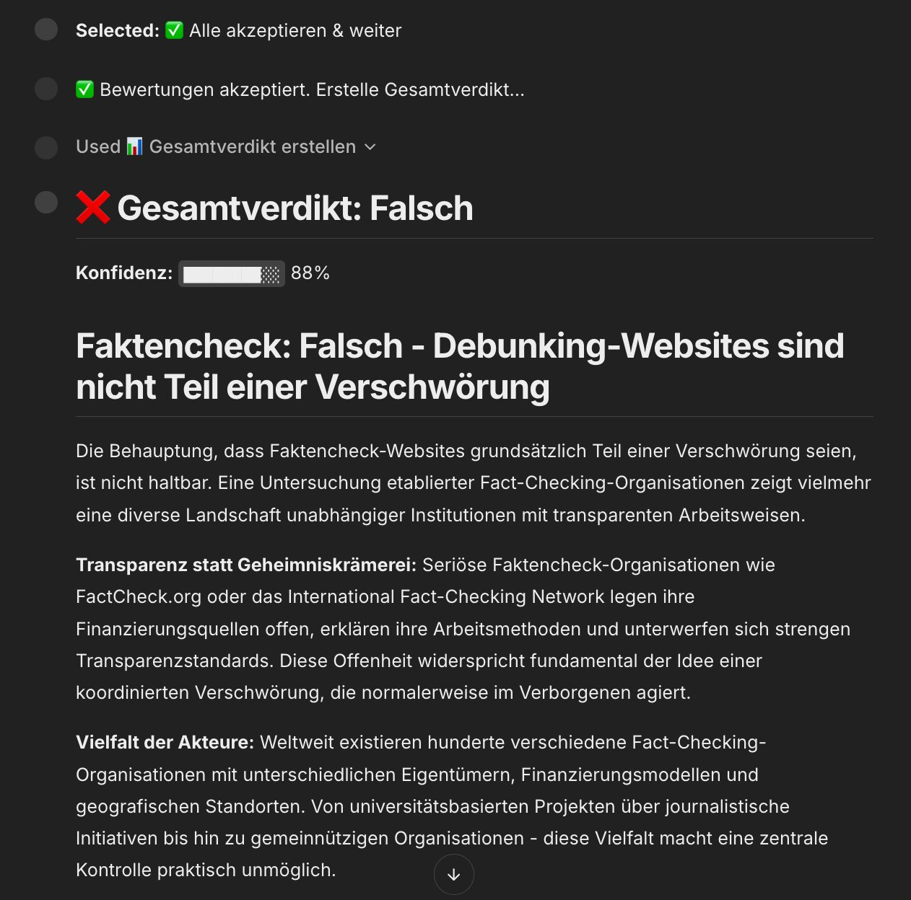

# 🔍 FactAgent – Interaktiver Faktencheck-Assistent

Ein AI-powered Faktencheck-Tool, das Behauptungen automatisch zerlegt, im Web recherchiert, Quellen bewertet und ein strukturiertes Verdikt liefert.

**[▶ Live Demo →](https://thiev980-factagent.hf.space)**


---

<!-- Screenshots: ersetze die Platzhalter mit deinen eigenen Bildern -->
<p align="center">
  
</p>
<p align="center"><em>FactAgent zerlegt Behauptungen, recherchiert Quellen und liefert ein strukturiertes Verdikt</em></p>

<p align="center">
  
</p>
<p align="center"><em>Interaktiver Source Graph: Welche Quellen stützen welche Teilaussagen?</em></p>

## Was macht FactAgent?

Du gibst eine Behauptung ein – FactAgent überprüft sie:

```
Input:  "Die Schweiz hat die höchste Einwanderungsrate in Europa."
Output: 🟡 Teilweise wahr (78% Konfidenz)
        Die Schweiz hat eine der höchsten Einwanderungsraten in Europa,
        liegt aber hinter Luxemburg und Malta...
```

## AI-Engineering-Patterns

Dieses Projekt demonstriert 8 AI-Engineering-Konzepte:

### 1. Agentic Workflow (ReAct Pattern)
Der Agent durchläuft autonom 4 Schritte – nicht ein einzelner API-Call, sondern eine orchestrierte Pipeline:

```
Claim Decomposer → Evidence Retriever → Source Evaluator → Verdict Synthesizer
```

### 2. RAG (Retrieval Augmented Generation)
Das LLM recherchiert aktiv im Web, statt sich auf Trainingsdaten zu verlassen. Jede Aussage wird mit aktuellen, externen Quellen abgeglichen.

### 3. Structured Output
Jeder LLM-Call liefert validiertes JSON (via Pydantic Models) – keine Freitext-Interpretation nötig. Bei Parse-Fehlern greift ein automatischer Retry-Mechanismus mit JSON-Reparatur.

### 4. Prompt Engineering
Jeder Agent-Schritt hat einen spezialisierten Prompt mit Rollenanweisung, Beispielen und Constraints. Prompts sind dokumentiert und versioniert.

### 5. Streaming
Token-by-Token Streaming für Echtzeit-Feedback. Die Zusammenfassung wird live geschrieben, während der User zuschaut. Implementiert mit AsyncAnthropic und Chainlit Streaming.

### 6. Human-in-the-Loop
Nach der automatischen Bewertung kann der User jedes Teilurteil überprüfen und korrigieren. Menschliche Korrekturen fliessen gewichtet in das Gesamtverdikt ein.

### 7. Historische Claims (Knowledge Base)
SQLite-Datenbank mit FTS5 Full-Text Search speichert alle Checks. Ähnliche frühere Behauptungen werden erkannt, um redundante API-Calls zu vermeiden.

### 8. Source Graph (Explainability)
Interaktive vis.js-Netzwerk-Visualisierung zeigt, welche Quellen welche Teilaussagen stützen. Farben kodieren Verdikt und Glaubwürdigkeit.

### Evaluation
Ein Eval-Set mit 15 Behauptungen (bekannte Verdikts) ermöglicht systematisches Testen und Accuracy-Tracking.

## Architektur

```
User Input (Behauptung)
        │
        ▼
┌─────────────────────┐
│  Claim Decomposer   │  LLM-Call: Zerlegt in Teilaussagen
│  (Claude Sonnet)     │  + generiert Suchanfragen
└────────┬────────────┘
         │
         ▼
┌─────────────────────┐
│  Evidence Retriever  │  Tavily API: Web Search + Extraktion
│  (Tavily Search)     │  Deduplizierung, Ranking
└────────┬────────────┘
         │
         ▼
┌─────────────────────┐
│  Source Evaluator     │  LLM-Call: Relevanz, Glaubwürdigkeit,
│  (Claude Sonnet)     │  Verdikt pro Teilaussage
└────────┬────────────┘
         │
         ▼
┌─────────────────────┐
│  👤 Human Review     │  User kann Verdikts korrigieren
│  (optional)          │  oder Kontext hinzufügen
└────────┬────────────┘
         │
         ▼
┌─────────────────────┐
│  Verdict Synthesizer │  LLM-Call: Gesamtbewertung mit
│  (Claude Sonnet)     │  Zusammenfassung und Quellen
└────────┬────────────┘
         │
         ├──→ 💾 SQLite (Historische Claims)
         ├──→ 🕸️ Source Graph (vis.js HTML)
         │
         ▼
   Chat UI (Chainlit)
```

## Tech Stack

| Komponente | Technologie | Warum? |
|---|---|---|
| LLM | Claude API (Sonnet) | Starke Reasoning-Fähigkeiten, gutes Preis-Leistungs-Verhältnis |
| Orchestrierung | LangGraph | State-Management, Routing, Error Handling |
| Web Search | Tavily API | Speziell für AI-Agents gebaut, hohe Qualität |
| Structured Output | Pydantic v2 | Schema-Validierung, Typsicherheit |
| Frontend | Chainlit | Chat-UI mit Step-Visualisierung + Streaming |
| Datenbank | SQLite + FTS5 | Zero-Config, Full-Text Search eingebaut |
| Visualisierung | vis.js | Interaktive Netzwerk-Graphen |
| Deployment | HF Spaces (Docker) | Kostenlos, AI-Community |

## Lokale Installation

### Voraussetzungen
- Python 3.11+
- Anthropic API Key ([console.anthropic.com](https://console.anthropic.com/))
- Tavily API Key ([tavily.com](https://tavily.com/) – kostenloser Tier)

### Installation

```bash
# Repository klonen
git clone https://github.com/DEIN-USERNAME/factagent.git
cd factagent

# Virtual Environment erstellen
python -m venv venv
source venv/bin/activate  # macOS/Linux

# Dependencies installieren
pip install -r requirements.txt

# API-Keys konfigurieren
cp .env.example .env
# → .env editieren und Keys eintragen
```

### Starten

```bash
chainlit run app.py
# → Öffnet http://localhost:8000
```

### Chat-Befehle

| Befehl | Beschreibung |
|---|---|
| `/history` | Letzte 10 Faktenchecks anzeigen |
| `/stats` | Statistiken (Anzahl, Verdikts, etc.) |

### Evaluation ausführen

```bash
python -m eval.run_eval          # Alle 15 Test-Claims
python -m eval.run_eval --limit 5  # Nur die ersten 5
```

## Deployment (Hugging Face Spaces)

1. Space erstellen auf [huggingface.co/new-space](https://huggingface.co/new-space)
   - SDK: **Docker**
   - Visibility: Public oder Private
2. Secrets hinzufügen (Settings → Variables and Secrets):
   - `ANTHROPIC_API_KEY`
   - `TAVILY_API_KEY`
3. Code pushen:
   ```bash
   git remote add hf https://huggingface.co/spaces/DEIN-USERNAME/factagent
   git push hf main
   ```

Die App startet automatisch und ist unter `https://DEIN-USERNAME-factagent.hf.space` erreichbar.

## Projektstruktur

```
factagent/
├── app.py                  # Chainlit Web App (Frontend + HITL)
├── Dockerfile              # HF Spaces Deployment
├── requirements.txt
├── .env.example            # API-Key Template
├── agent/
│   ├── models.py           # Pydantic Models (Structured Output)
│   ├── prompts.py          # Alle Prompts (Prompt Engineering)
│   ├── tools.py            # Tavily Search (RAG)
│   ├── nodes.py            # Agent-Schritte (Streaming + Retry)
│   ├── graph.py            # LangGraph Workflow (Orchestrierung)
│   ├── database.py         # SQLite + FTS5 (Historische Claims)
│   ├── source_graph.py     # vis.js Netzwerk-Visualisierung
│   └── rate_limiter.py     # API-Schutz für öffentliches Deployment
├── eval/
│   ├── eval_set.json       # 15 Test-Behauptungen
│   └── run_eval.py         # Evaluations-Script
└── README.md
```

## Verdikt-Kategorien

| Verdikt | Emoji | Bedeutung |
|---|---|---|
| `true` | ✅ | Durch Evidenz bestätigt |
| `false` | ❌ | Durch Evidenz widerlegt |
| `partially_true` | 🟡 | Teilweise korrekt, mit Einschränkungen |
| `misleading` | ⚠️ | Technisch korrekt, aber irreführend |
| `unverifiable` | ❓ | Nicht genügend verlässliche Quellen |

## Kosten

Pro Faktencheck fallen ca. 3-5 Claude API Calls an (Sonnet):
- Claim Decomposition: ~500 Input + 500 Output Tokens
- Evidence Evaluation: ~2000 Input + 500 Output Tokens (pro Teilaussage)
- Verdict Synthesis: ~2000 Input + 500 Output Tokens
- Streaming Summary: ~1000 Input + 500 Output Tokens
- Tavily: 1000 kostenlose Suchen/Monat

**Geschätzt: ~$0.01-0.03 pro Faktencheck** (mit Claude Sonnet)

## Über mich

Data Analyst mit Hintergrund in Soziologie – fokussiert auf die Schnittstelle von Gesellschaft, Medien und KI. Dieses Projekt entstand als Portfolio-Showcase für AI Engineering.

---

*Built with Claude API, LangGraph, Tavily, Chainlit, and vis.js*
